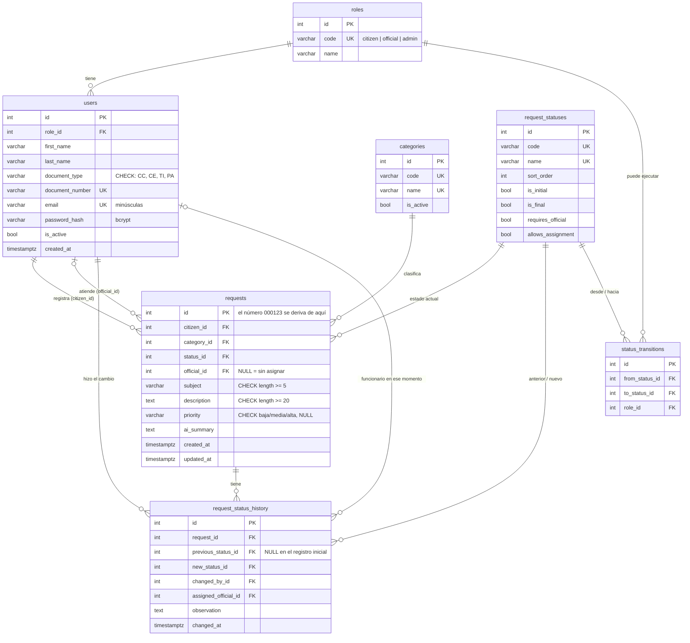

# Modelo entidad-relación

El diagrama se dibuja solo en GitHub (Mermaid). El SQL completo está en
[`database/schema.sql`](../database/schema.sql).

## Decisiones

| Decisión | Por qué |
|---|---|
| Roles, categorías y estados son **tablas**, no textos sueltos ni `ENUM` | Se agregan o renombran sin tocar código. Las llaves foráneas impiden guardar una categoría o un estado que no existe. |
| Tabla `status_transitions` | El flujo de estados es un dato. Todo lo que no está en la tabla se rechaza, y agregar un paso nuevo es insertar una fila (principio Abierto/Cerrado). |
| El número de solicitud **no se guarda** | Se deriva del `id` (`LPAD(id, 6, '0')`). Guardarlo aparte duplicaría información que puede desincronizarse, como pide evitar la prueba. |
| `requests.status_id` sí se guarda aunque el historial lo tenga | Es el estado *actual*. Sin él, filtrar por estado exigiría buscar el último registro del historial de cada solicitud. Se escribe en la misma transacción que el historial, así que no se desincroniza. |
| `history.assigned_official_id` | No es redundante: guarda quién estaba asignado *en ese momento*. Si la solicitud se reasigna, el historial conserva lo que pasó. |
| `UNIQUE` en correo y documento | Es la última barrera contra duplicados, aunque el servicio ya lo valide (evita el caso de dos registros simultáneos). |
| `CHECK` en longitudes, prioridad y tipo de documento | La base de datos no confía ni siquiera en el backend. |
| Trigger que rechaza `UPDATE`/`DELETE` en el historial | "El historial no debe poder eliminarse": ni desde la interfaz (no hay endpoint) ni saltándose la API. |

## Índices

- `requests(citizen_id)`, `requests(official_id)`: consultas "mis solicitudes" y "asignadas a mí".
- `requests(status_id)`, `requests(category_id)`: filtros del administrador.
- `requests(created_at)`: orden por fecha y "las 10 más recientes".
- `request_status_history(request_id, changed_at)`: historial de una solicitud, ya ordenado.
- Los `UNIQUE` (correo, documento, códigos) crean su propio índice: el login busca por correo.
